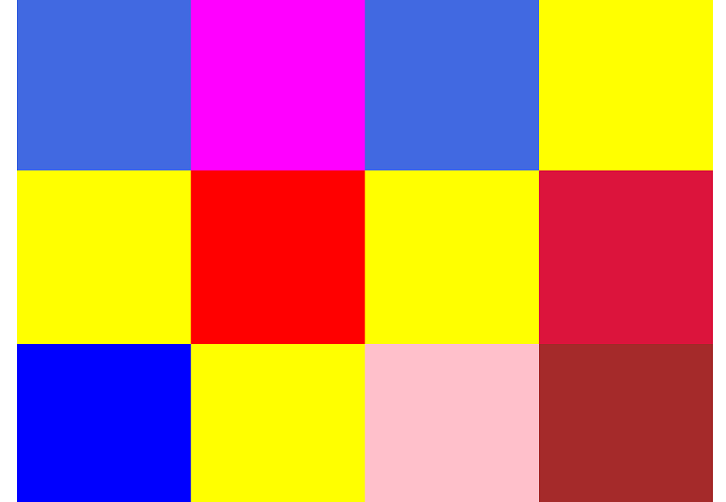

# Color Boxes App in React

Color Boxes is a create react app. It was created for desktop views. It is displaying
16 boxes with different colors. Clicking on any box changes its color to different one.

## Tools & Technology used

- Visual Studio Code
- React
- HTML
- CSS
- UUID
